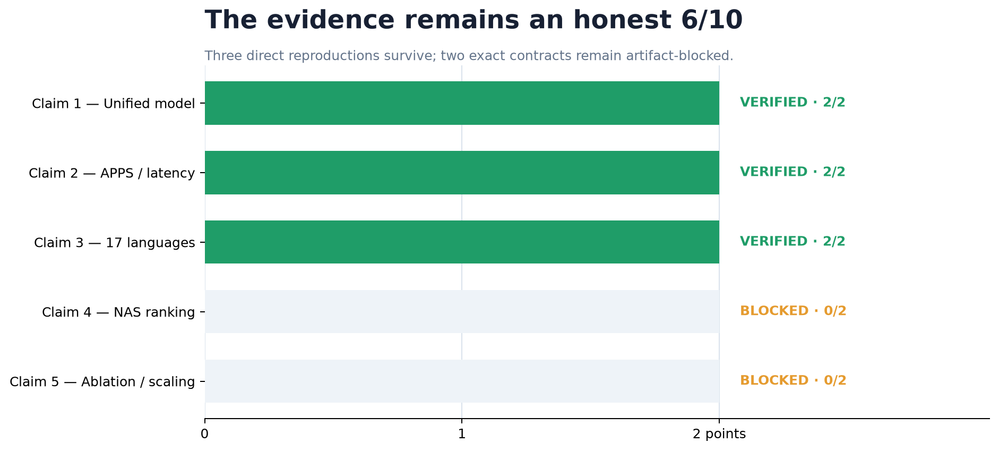
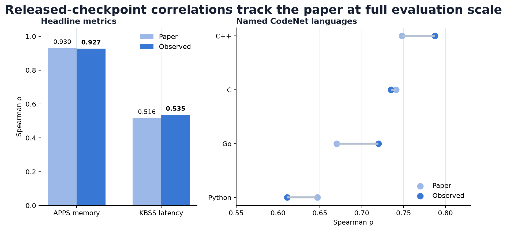
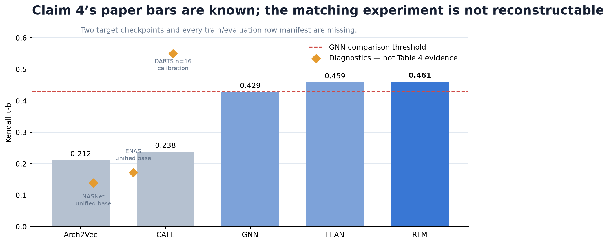
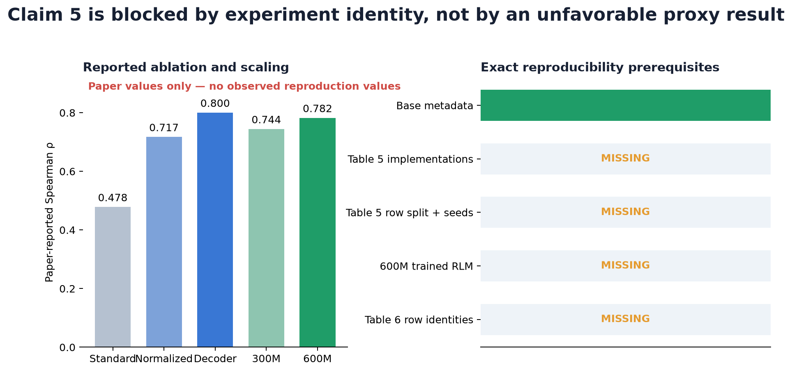

# Regression Language Models for Code — claim-by-claim reproduction



- **Previous live judged score:** `6/10`
- **Conservative projected score range after this change:** `6–6/10`
- **Best-supported possible new score:** `6/10` — forecast only, not a judge result

The central question is unusually concrete: can one language model read code and
rank its memory, latency, or accuracy, and do its reported architecture-ranking,
ablation, and scaling comparisons survive an exact reproduction? The released
checkpoint supports the first half. The public artifacts do not identify the
experiments needed for the second half.

## What was tested

The campaign converted all five judged claims into fail-closed contracts. Claims
1–3 reuse preserved paper-scale predictions but independently recompute their
statistics and hashes. Claims 4–5 require the exact metric, model identity,
training/evaluation rows, and comparator formulation; nearby proxies are
explicitly rejected.

| Claim | Current points | Possible points | Confidence | Evidence status | Basis and remaining risk |
|---|---:|---:|---|---|---|
| 1 — one model predicts memory, latency, and accuracy | 2 | 2 | HIGH | VERIFIED | One 181,458,944-parameter released checkpoint produces positive rank correlations for all three targets; the paper’s “300M” label remains discrepant. |
| 2 — APPS 0.930 and kernel latency 0.516 | 2 | 2 | HIGH | VERIFIED | APPS ρ=0.926807 and KBSS ρ=0.535279 at n=512 each, with retained predictions and controls. |
| 3 — positive ranking across 17 CodeNet languages | 2 | 2 | HIGH | VERIFIED | Mean per-language ρ=0.529850 at 200 rows/language; independent CPU result 0.523403. Individual values differ from Table 3. |
| 4 — five-space Kendall comparison | 0 | 2 | LOW | BLOCKED | Correct Kendall contract reconstructed and one released checkpoint path calibrated, but ENAS/NASNet target models and all row manifests are absent. Four routes found no valid counterexample. |
| 5 — regression-head ablation and 300M→600M scaling | 0 | 2 | LOW | BLOCKED | Exact tables and cited normalization code audited, but head implementations, splits, checkpoints, 600M RLM, and row identities are absent. Four routes found no valid counterexample. |

Current total: **6/10**. Claims 4 and 5 changed from unaddressed/inconclusive to
rigorously **BLOCKED**, not to point-bearing results. Only a live judge can
change the score.

## The released checkpoint evidence



The fixed verifier follows the released model’s digit-token decoder: prefix the
input by task, sample eight nine-token numeric outputs, convert tokens back to
floats, take the median, and compute rank correlation. The most consequential
compatibility choice is pinning `transformers==4.53.2`; the repository’s
`uv.lock` also pins the full Python 3.12 CPU environment.

The APPS and latency results track the paper closely. Across CodeNet, the
aggregate positive-ranking claim survives, but the language-by-language values
are not replicas of Table 3. C++ is 0.787570 observed versus 0.748 reported;
C is 0.735096 versus 0.741; Go is 0.720114 versus 0.670; Python is 0.610921
versus 0.647.

The cumulative checker recomputes 1,536 ONNX prediction medians and three
accuracy correlations, then 17 separate CodeNet correlations and their mean.
It integrity-checks the APPS/KBSS bundle. Artifact mutation, missing rows, or a
changed hash exits nonzero.

## Why Claim 4 is blocked



Table 4 is not a generic NASBench Spearman claim. It is Kendall τ-b over NASNet,
Amoeba, PNAS, ENAS, and DARTS after target-specific few-shot training, with an
RLM mean of 0.461 versus Arch2Vec 0.212, CATE 0.238, GNN 0.429, and FLAN 0.459.

The audit found public target-specific checkpoints only for Amoeba, PNAS, and
DARTS. None includes the few-shot or evaluation row identities. Recomputing
Kendall on retained unified-base predictions gives 0.172070 for ENAS and
0.138758 for NASNet, but those are the wrong models and are diagnostics only.

A CPU-upgrade calibration ran the pinned DARTS checkpoint end to end on 16
released rows with 128 raw draws. Its τ-b was 0.55 and a 200-permutation
shuffled-target control had mean −0.013583. The 192.011-second inference time
projects to roughly 102 minutes for 512 rows, but the bounded sample cannot
exclude unknown fine-tuning rows or represent the full target domain. Four
different routes, including a dedicated falsification search, therefore end at
BLOCKED.

## Why Claim 5 is blocked



Table 5 reports decoder-head ρ=0.800, normalized-head 0.717, and standard-head
0.478 on 512 NASBench101 samples. Table 6 reports 0.782 for a 600M T5Gemma b-b
RLM versus 0.744 for a 300M s-s RLM on 1,024 CodeNet samples.

The source audit pinned paper-time and current official `regress-lm` trees and
inspected all 27/29 text files. It found no dedicated Table 5/6 artifact. The
author’s public listing contains five relevant RLM releases but no ablation
checkpoint or 600M RLM. Public base metadata confirms 312,517,632 and
591,490,560 parameters, making the rounded labels plausible but saying nothing
about the 0.038 performance difference.

The cited Qin implementation independently confirms a one-output regression
head with per-dataset `MinMaxScaler([0,1])`; its pinned source hash is
`e5b2e3d3…7558f3`. That related code does not identify the paper’s split,
pooling, schedule, or checkpoints. A synthetic `table5_regression_head.yaml`
control proves the artifact detector can flag an exact-looking file, while the
control itself is rejected as evidence. The fourth route found no
assumption-satisfying counterexample, so Claim 5 is BLOCKED.

## Experiment tree and compute

The tree is a stacked chain: freeze and repair the cumulative baseline, audit
Claim 4, descend through a faithful checkpoint calibration, finalize its
four-route verdict, then audit and finalize Claim 5.

| Experiment / branch | Exact fixed command | Outcome | Compute |
|---|---|---|---|
| [`orx/frozen-6-10-cumulative-baseline`](https://github.com/MachineLearning-Nerd/icml26-repro-utTapVWtc7/tree/orx/frozen-6-10-cumulative-baseline) | `uv run --locked python repro/src/run_campaign.py` | Rejected provenance mix-up | Local CPU, 4m20s |
| [`orx/correct-dual-codenet-provenance`](https://github.com/MachineLearning-Nerd/icml26-repro-utTapVWtc7/tree/orx/correct-dual-codenet-provenance) | `uv run --locked python repro/src/run_campaign.py` | Claims 1–3 cumulative PASS | Hugging Face `cpu-upgrade`, 48s |
| [`orx/claim-4-released-checkpoint-kendall-audit`](https://github.com/MachineLearning-Nerd/icml26-repro-utTapVWtc7/tree/orx/claim-4-released-checkpoint-kendall-audit) | `uv run --locked python repro/src/run_campaign.py` | Claim 4 BLOCKED | Hugging Face `cpu-upgrade`, 37s |
| [`orx/calibrate-claim-4-with-accepted-config-compatibi`](https://github.com/MachineLearning-Nerd/icml26-repro-utTapVWtc7/tree/orx/calibrate-claim-4-with-accepted-config-compatibi) | `uv run --locked python repro/src/run_campaign.py` | DARTS diagnostic only; BLOCKED | Hugging Face `cpu-upgrade`, 64 CPUs allocated, 5m12s |
| [`orx/finalize-claim-4-four-route-blocked-verdict`](https://github.com/MachineLearning-Nerd/icml26-repro-utTapVWtc7/tree/orx/finalize-claim-4-four-route-blocked-verdict) | `uv run --locked python repro/src/run_campaign.py` | Claim 4 final BLOCKED | Local CPU, 55s |
| [`orx/record-claim-5-exact-audit-evidence`](https://github.com/MachineLearning-Nerd/icml26-repro-utTapVWtc7/tree/orx/record-claim-5-exact-audit-evidence) | `uv run --locked python repro/src/run_campaign.py` | Claim 5 final BLOCKED; Claims 1–3 PASS | Local CPU, 1m10s |
| [`orx/prepare-evaluator-visible-cumulative-release`](https://github.com/MachineLearning-Nerd/icml26-repro-utTapVWtc7/tree/orx/prepare-evaluator-visible-cumulative-release) | `uv run --locked python repro/src/run_campaign.py` | Evaluator-visible cumulative PASS; blind review round 2 | Local CPU, 1m10s |
| [`orx/make-space-verifiers-standalone`](https://github.com/MachineLearning-Nerd/icml26-repro-utTapVWtc7/tree/orx/make-space-verifiers-standalone) | `uv run --locked python repro/src/run_campaign.py` | Formal cumulative and standalone downloaded-Space suites PASS; exact gates fail closed | Local CPU, one estimated core, 2m03s end to end |
| `master` | Not run as an experiment (publication surface) | Reader-facing report and notebook | No compute |

No GPU was used in this campaign. Hugging Face jobs expose CPU allocation but
no monetary-cost field; local runs likewise report no monetary cost.

## Reproduce and inspect

The formal command is identical on every node:

```bash
uv run --locked python repro/src/run_campaign.py
```

The current phase runs the static Claim 5 checker, a fresh public-source audit,
the final Claim 4 checker, and Claims 1–3. Exact Claim 4/5 gates exit 1 while
BLOCKED; the cumulative command requires those nonzero exits.

Key evidence:

- `.openresearch/artifacts/cumulative_baseline/`
- `.openresearch/artifacts/claim4_released_audit/`
- `.openresearch/artifacts/claim4_cpu_calibration/`
- `.openresearch/artifacts/claim5_ablation_scaling/`
- `.trackio/logbook/pages/claim-4-kendall-ranking/page.md`
- `.trackio/logbook/pages/claim-5-ablation-scaling/page.md`
- `.openresearch/artifacts/release/command_ledger.md` (orchestration,
  publication, and post-publication commands)

The tutorial notebook `notebooks/regresslm_reproduction.py` embeds the accepted
numbers and figures, so opening it does not rerun inference.

## Final assessment

The paper’s released checkpoint supports the unified regression capability and
the two headline Table 3 checks at the evaluated scale. It does not make the
target-specific NAS comparison or the head/scaling ablations independently
reconstructable. The release therefore preserves the live 6/10 evidence,
answers both judge criticisms with exact fail-closed contracts, and makes no
unsupported score forecast.

Claims still BLOCKED:

- Claim 4 needs ENAS/NASNet target checkpoints plus all five exact train/eval
  row manifests and configuration.
- Claim 5 needs the three exact head implementations/checkpoints and splits,
  plus the exact 300M/600M RLMs and Table 6 row identities.

The text-only release was published only to the existing
`DineshAI/utTapVWtc7` Space at revision
`f791e670006b5d428a2e11593eb29fb568bb4b45`. A fresh exact-revision download
verified all 67 uploaded paths byte-for-byte, all 66 manifest hashes, all 21
protected judged files, every relative link reached from `README.md`, and the
standalone release checker. The revision is awaiting live judge evaluation;
the score remains 6/10 until that evaluator records a new verdict.
